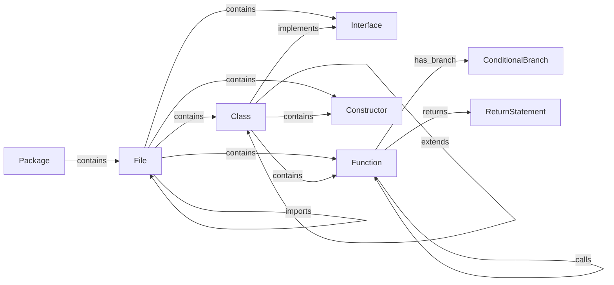

# CodeLens Data Model

## Graph Overview

## Node Types

| Node Type | Purpose |
|------------|------------|
| Package | Package namespace |
| File | Source file |
| Class | Class declaration |
| Interface | Interface declaration |
| Function | Method or standalone function |
| Constructor | Constructor definition |
| ConditionalBranch | if / else / switch branch |
| ReturnStatement | Return statement |

## Common Node Properties

All graph nodes are represented by the `CodeNode` model.

| Property | Description |
|-----------|-------------|
| uid | Globally unique identifier |
| name | Symbol name |
| qualified_name | Fully-qualified symbol name |
| node_type | Node category |
| filepath | Relative repository path |
| start_line | Start line number |
| end_line | End line number |
| docstring | Documentation text (optional) |
| signature | Function/constructor signature (optional) |
| file_hash | Source file hash used for incremental indexing |

## Relationship Types

| Relationship | Meaning |
|-------------|----------|
| contains | Parent-child ownership |
| calls | Function invocation |
| imports | File dependency |
| implements | Class implements interface |
| extends | Class inheritance |
| has_branch | Function owns a conditional branch |
| returns | Function returns a value |

## Graph Storage Models

### CodeNode

Represents a code entity extracted from the AST.

### CodeEdge

Represents a directed relationship between two nodes.

### ParseResult

Represents the extraction result of a parsed source file.